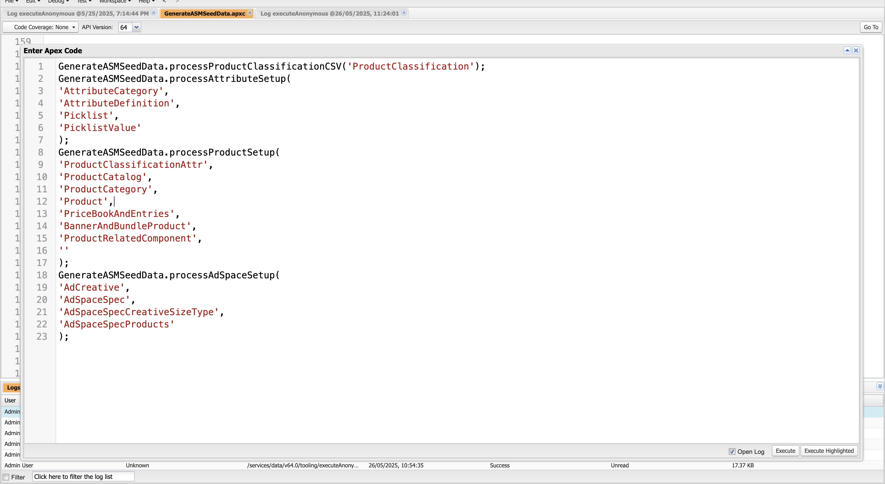

# Script for Sample Product Data Setup

Create a new apex class and copy the below code.

```
    public class GenerateASMSeedData {

    public static List<Map<String, String>> productClassificationDataList = new List<Map<String, String>>();
    public static Map<String, Product2> allProductsByName = new Map<String, Product2>();
    public static Map<String, Id> categoryMap = new Map<String, Id>();
    public static Map<String, Id> definitionMap = new Map<String, Id>();
    public static Map<String, Id> groupMap = new Map<String, Id>();
    
    public static void processProductClassificationCSV(String fileName) {
        try {
            ContentVersion cv = [
                SELECT Id, Title, VersionData 
                FROM ContentVersion 
                WHERE Title = :fileName 
                ORDER BY CreatedDate DESC 
                LIMIT 1
            ];
            String fileContent = cv.VersionData.toString();
            productClassificationDataList = parseProductClassificationCSV(fileContent);
            
            
            
        } catch (Exception e) {
            System.debug('Error processing Product Classification CSV file: ' + e.getMessage());
        }
    }
    
    private static List<Map<String, String>> parseProductClassificationCSV(String csvContent) {
        List<Map<String, String>> productClassificationDataList = new List<Map<String, String>>();
        List<String> lines = csvContent.split('\n');
        
        if (lines.size() < 2) return productClassificationDataList;
        
        String delimiter = lines[0].contains(';') ? ';' : ',';
        List<String> headers = lines[0].split(delimiter);
        
        for (Integer i = 1; i < lines.size(); i++) {
            List<String> values = lines[i].split(delimiter);
            
            while (values.size() < headers.size()) {
                values.add('');
            }
            
            if (values.size() != headers.size()) continue;
            
            Map<String, String> row = new Map<String, String>();
            for (Integer j = 0; j < headers.size(); j++) {
                row.put(headers[j].trim(), values[j].trim());
            }
            
            productClassificationDataList.add(row);
        }
        
        return productClassificationDataList;
    }
    
    
    public static void processAttributeSetup(
        String categoryFileName,
        String definitionFileName,
        String picklistFileName,
        String picklistValueFileName
    ) {
        try {
            // Step 1: Fetch ContentVersion files
            ContentVersion catCV = (String.isNotBlank(categoryFileName))
                ? [SELECT Id, Title, VersionData FROM ContentVersion WHERE Title = :categoryFileName ORDER BY CreatedDate DESC LIMIT 1]
                : null;
            
            ContentVersion defCV = (String.isNotBlank(definitionFileName))
                ? [SELECT Id, Title, VersionData FROM ContentVersion WHERE Title = :definitionFileName ORDER BY CreatedDate DESC LIMIT 1]
                : null;
            
            ContentVersion plCV = (String.isNotBlank(picklistFileName))
                ? [SELECT Id, Title, VersionData FROM ContentVersion WHERE Title = :picklistFileName ORDER BY CreatedDate DESC LIMIT 1]
                : null;
            
            ContentVersion plValCV = (String.isNotBlank(picklistValueFileName))
                ? [SELECT Id, Title, VersionData FROM ContentVersion WHERE Title = :picklistValueFileName ORDER BY CreatedDate DESC LIMIT 1]
                : null;
            
            // Step 2: Parse CSVs (with null/empty check)
            List<Map<String, String>> categoryData = (catCV != null && catCV.VersionData != null) ? parseCsv(catCV.VersionData.toString()) : new List<Map<String, String>>();
            List<Map<String, String>> definitionData = (defCV != null && defCV.VersionData != null) ? parseCsv(defCV.VersionData.toString()) : new List<Map<String, String>>();
            List<Map<String, String>> picklistData = (plCV != null && plCV.VersionData != null) ? parseCsv(plCV.VersionData.toString()) : new List<Map<String, String>>();
            List<Map<String, String>> picklistValueData = (plValCV != null && plValCV.VersionData != null) ? parseCsv(plValCV.VersionData.toString()) : new List<Map<String, String>>();
            
            
            // Step 3: Insert Attribute Categories
            if (!categoryData.isEmpty()) {
                insertAttributeCategories(categoryData);
            }
            
            // Step 4: Insert Picklists First
            Map<String, Id> picklistMap = new Map<String, Id>();
            if (!picklistData.isEmpty()) {
                picklistMap = insertAttributePicklists(picklistData);
            }
            
            // Step 5: Insert Picklist Values
            if (!picklistValueData.isEmpty() && !picklistMap.isEmpty()) {
                insertAttributePicklistValues(picklistValueData, picklistMap);
            }
            
            // Step 6: Insert Attribute Definitions with PicklistId and Activate
            
            if (!definitionData.isEmpty()) {
                insertAttributeDefinitions(definitionData, picklistMap);
            }
            
            // Step 7: Insert into Attribute Category Items (link Category ↔ Definition)
            if (!categoryMap.isEmpty() && !definitionMap.isEmpty()) {
                insertAttributeCategoryItems(categoryMap, definitionMap);
            }
            
            System.debug('✅ Attribute setup completed successfully.');
            
        } catch (Exception e) {
            System.debug('❌ Error during attribute setup: ' + e.getMessage());
            throw e;
        }
        
    }
    
    // Parse CSV content into List of Maps
    private static List<Map<String, String>> parseCsv(String csvContent) {
        List<Map<String, String>> records = new List<Map<String, String>>();
        List<String> lines = csvContent.split('\n');
        
        if (lines.isEmpty()) return records;
        
        List<String> headers = lines[0].replace('\r', '').split(',');
        
        for (Integer i = 1; i < lines.size(); i++) {
            String line = lines[i].trim();
            if (String.isBlank(line)) continue;
            
            List<String> values = line.replace('\r', '').split(',');
            Map<String, String> record = new Map<String, String>();
            
            for (Integer j = 0; j < headers.size() && j < values.size(); j++) {
                record.put(headers[j].trim(), values[j].trim());
            }
            records.add(record);
        }
        return records;
    }
    private static void insertAttributeCategories(List<Map<String, String>> categoryDataList) {
        List<AttributeCategory> categories = new List<AttributeCategory>();
        
        for (Map<String, String> data : categoryDataList) {
            AttributeCategory cat = new AttributeCategory();
            cat.Name = data.get('Name');
            categories.add(cat);
        }
        
        insert categories;
        
        
        for (AttributeCategory cat : categories) {
            categoryMap.put(cat.Name, cat.Id);
        }
    }
    public static Map<String, Id> insertAttributePicklists(List<Map<String, String>> picklistDataList) {
        List<AttributePicklist> picklists = new List<AttributePicklist>();
        
        for (Map<String, String> data : picklistDataList) {
            AttributePicklist pl = new AttributePicklist();
            pl.Name = data.get('Name');
            pl.Status = data.get('Status');
            pl.DataType = data.get('DataType');
            pl.Code = data.get('Code');
            picklists.add(pl);
        }
        
        insert picklists;
        
        Map<String, Id> picklistMap = new Map<String, Id>();
        for (AttributePicklist pl : picklists) {
            picklistMap.put(pl.Name, pl.Id);
        }
        return picklistMap;
    }
    
    public static void insertAttributePicklistValues(List<Map<String, String>> picklistValueDataList, Map<String, Id> picklistMap) {
        List<AttributePicklistValue> picklistValues = new List<AttributePicklistValue>();
        
        for (Map<String, String> data : picklistValueDataList) {
            
            String picklistName = data.get('PicklistName');
            Id picklistId = picklistMap.get(picklistName); 
            System.debug(picklistId);
            if (picklistId != null) {
                AttributePicklistValue plVal = new AttributePicklistValue();
                plVal.Name = data.get('Name');
                plVal.Code = data.get('Value');
                String sequenceStr = data.get('Sequence');
if (!String.isBlank(sequenceStr)) {
plVal.Sequence = Decimal.valueOf(sequenceStr);
}
plVal.Value = data.get('Value');
plVal.PicklistId = picklistId ;
plVal.Status = 'Active';
System.debug(picklistId);
System.debug(plVal.getSObjectType());

                picklistValues.add(plVal);
                if (String.isBlank(plVal.Name) || String.isBlank(plVal.Code)) {
                    System.debug('⚠️ Skipping invalid picklist value: ' + data);
                    continue;
                }
                
            }
        }
        
        if (!picklistValues.isEmpty()) {
            insert picklistValues;
            System.debug('Picklist values successfully inserted');
        }
    }
    
    
    public static void insertAttributeDefinitions(
        List<Map<String, String>> definitionDataList,
        Map<String, Id> picklistMap
    ) {
        List<AttributeDefinition> definitions = new List<AttributeDefinition>();
        
        for (Map<String, String> data : definitionDataList) {
            AttributeDefinition def = new AttributeDefinition();
            def.Name = data.get('Name');
            def.Label = data.get('Label');
            def.Code = data.get('Code');
            def.DataType = data.get('DataType');
            String picklistName = 'RateType';
            def.IsActive = true;
            
            // Assign PicklistId if available
            if (picklistMap.containsKey(picklistName)) {
                def.PicklistId = picklistMap.get(picklistName);
            }
            
            definitions.add(def);
        }
        
        insert definitions;
        
        
        for (AttributeDefinition def : definitions) {
            definitionMap.put(def.Name, def.Id);
        }
        
    }
    
    
    private static void insertAttributeCategoryItems(Map<String, Id> categoryMap, Map<String, Id> definitionMap) {
        List<AttributeCategoryAttribute> items = new List<AttributeCategoryAttribute>();
        
        for (String categoryName : categoryMap.keySet()) {
            for (String defName : definitionMap.keySet()) {
                AttributeCategoryAttribute item = new AttributeCategoryAttribute();
                item.AttributeCategoryId = categoryMap.get(categoryName);
                item.AttributeDefinitionId = definitionMap.get(defName);
                items.add(item);
            }
        }
        
        insert items;
    }
    
    public static void processProductSetup(
        String productClassificationAttrFileName,
        String catalogFile,
        String categoryFile,
        String productFile,
        String priceBookFileName,
        String productBundleFile,
        String productRelatedCompFile,
        String bundleBasedAdjustmentFile
    ) {
        try {
            // Load content versions
            ContentVersion pcAttrCV = (String.isNotBlank(productClassificationAttrFileName))
                ? [SELECT Id, Title, VersionData FROM ContentVersion WHERE Title = :productClassificationAttrFileName ORDER BY CreatedDate DESC LIMIT 1]
                : null;
            
            ContentVersion catalogCV = String.isNotBlank(catalogFile)
                ? [SELECT Id, Title, VersionData FROM ContentVersion WHERE Title = :catalogFile ORDER BY CreatedDate DESC LIMIT 1]
                : null;
            
            ContentVersion catCV = String.isNotBlank(categoryFile)
                ? [SELECT Id, Title, VersionData FROM ContentVersion WHERE Title = :categoryFile ORDER BY CreatedDate DESC LIMIT 1]
                : null;
            
            ContentVersion prodCV = String.isNotBlank(productFile)
                ? [SELECT Id, Title, VersionData FROM ContentVersion WHERE Title = :productFile ORDER BY CreatedDate DESC LIMIT 1]
                : null;
            
            ContentVersion priceBookCV = String.isNotBlank(priceBookFileName)
                ? [SELECT Id, Title, VersionData FROM ContentVersion WHERE Title = :priceBookFileName ORDER BY CreatedDate DESC LIMIT 1]
                : null;
            
            ContentVersion bannerBundleCV = String.isNotBlank(productBundleFile)
                ? [SELECT Id, Title, VersionData FROM ContentVersion WHERE Title = :productBundleFile ORDER BY CreatedDate DESC LIMIT 1]
                : null;
            
            ContentVersion productRelatedCompCV = String.isNotBlank(productBundleFile)
                ? [SELECT Id, Title, VersionData FROM ContentVersion WHERE Title = :productRelatedCompFile ORDER BY CreatedDate DESC LIMIT 1]
                : null;
            
            ContentVersion bundleBasedAdjustmentCV = String.isNotBlank(bundleBasedAdjustmentFile)
                ? [SELECT Id, Title, VersionData FROM ContentVersion WHERE Title = :bundleBasedAdjustmentFile ORDER BY CreatedDate DESC LIMIT 1]
                : null;
            
            // Parse base CSVs
            List<Map<String, String>> pcAttrValueData = (pcAttrCV != null && pcAttrCV.VersionData != null) ? parseCsv(pcAttrCV.VersionData.toString()) : new List<Map<String, String>>();
            List<Map<String, String>> catalogData = (catalogCV != null) ? parseCsv(catalogCV.VersionData.toString()) : new List<Map<String, String>>();
            List<Map<String, String>> categoryData = (catCV != null) ? parseCsv(catCV.VersionData.toString()) : new List<Map<String, String>>();
            List<Map<String, String>> productData = (prodCV != null) ? parseCsv(prodCV.VersionData.toString()) : new List<Map<String, String>>();
            
            // Insert classification categories
            Map<String, Id> classificationCategoryMap = insertProductClassification(productClassificationDataList);
            insertProductClassficationAttr(pcAttrValueData,classificationCategoryMap);
            
            
            // Insert catalogs, categories, products
            Map<String, Id> catalogMap = insertProductCatalogs(catalogData);
            Map<String, Id> categoryMap = insertProductCategories(categoryData, catalogMap);
            Map<String, Id> productMap = insertProducts(productData, classificationCategoryMap, categoryMap);
            
            List<Map<String, String>> bundleData = parseBundleCsv(bannerBundleCV.VersionData.toString());
            
            insertBannersAndBundlesFromCsv(bundleData,classificationCategoryMap);
            
            insertProductCategoryProducts(productData,bundleData, categoryMap, allProductsByName);
            
            if (priceBookCV != null) {
                insertPricebookAndEntriesFromCSV(priceBookCV.VersionData.toString());
            }
            if(productRelatedCompCV != null)
            {
                List<Map<String, String>> productRelatedCompData = parseProductBundleChildCsv(productRelatedCompCV.VersionData.toString());
                insertProductRelatedComponentsFromRows(productRelatedCompData, allProductsByName, groupMap);
            }
            
            // Handle bundle-based price adjustments
            if (bundleBasedAdjustmentCV != null) {
                List<Map<String, String>> adjustmentData = parseCsv(bundleBasedAdjustmentCV.VersionData.toString());
                
                Map<String, PriceAdjustmentSchedule> priceScheduleMap = new Map<String, PriceAdjustmentSchedule>();
                for (PriceAdjustmentSchedule sched : [SELECT Id, Name FROM PriceAdjustmentSchedule]) {
                    priceScheduleMap.put(sched.Name, sched);
                }
                insertBundleBasedAdjustments(adjustmentData, priceScheduleMap);
            }
            
            System.debug('✅ Product setup completed successfully.');
            
        } catch (Exception e) {
            System.debug('❌ Error during product setup: ' + e.getMessage());
            throw e;
        }
    }
    
    
    private static Map<String, Id> insertProductClassification(List<Map<String, String>> dataList) {
        List<ProductClassification> records = new List<ProductClassification>();
        
        for (Map<String, String> data : dataList) {
            ProductClassification rec = new ProductClassification();
            rec.Name = data.get('Name');
            rec.Code = data.get('Code');
            rec.Status = 'Active';
            records.add(rec);
        }
        
        insert records;
        
        Map<String, Id> resultMap = new Map<String, Id>();
        for (ProductClassification rec : records) {
            resultMap.put(rec.Name, rec.Id);
        }
        return resultMap;
    }
    
    private static void insertProductClassficationAttr(
        List<Map<String, String>> pcAttrValueData,
        Map<String, Id> classificationCategoryMap
    ) {
        List<ProductClassificationAttr> pcAttrList = new List<ProductClassificationAttr>();
        
        for (Map<String, String> data : pcAttrValueData) {
            String productClassificationName = data.get('ProductClassificationName');
            String categoryName = data.get('AttributeCategory');
            String definitionName = data.get('AttributeDefintion');
            
            Id productClassificationId = classificationCategoryMap.get(productClassificationName);
            Id categoryId = categoryMap.get(categoryName);
            Id definitionId = definitionMap.get(definitionName);
            
            System.debug(productClassificationId);
            System.debug(categoryId);
            System.debug(definitionId);
            System.debug(definitionMap);
            if (productClassificationId == null || categoryId == null || definitionId == null) {
                System.debug('⚠️ Skipping record due to missing references: ' +
                             'Classification=' + productClassificationName + 
                             ', Category=' + categoryName + 
                             ', Definition=' + definitionName);
                continue;
            }
            
            ProductClassificationAttr pcAttr = new ProductClassificationAttr();
            pcAttr.Name = definitionName;
            pcAttr.ProductClassificationId = productClassificationId;
            pcAttr.AttributeCategoryId = categoryId;
            pcAttr.AttributeDefinitionId = definitionId;
            
            pcAttrList.add(pcAttr);
        }
        
        if (!pcAttrList.isEmpty()) {
            insert pcAttrList;
        }
    }
    
    private static Map<String, Id> insertProductCatalogs(List<Map<String, String>> dataList) {
        List<ProductCatalog> catalogs = new List<ProductCatalog>();
        
        for (Map<String, String> data : dataList) {
            ProductCatalog pc = new ProductCatalog();
            pc.Name = data.get('Name');
            catalogs.add(pc);
        }
        
        insert catalogs;
        
        Map<String, Id> resultMap = new Map<String, Id>();
        for (ProductCatalog rec : catalogs) {
            resultMap.put(rec.Name, rec.Id);
        }
        return resultMap;
    }
    
    private static Map<String, Id> insertProductCategories(List<Map<String, String>> dataList, Map<String, Id> catalogMap) {
        List<ProductCategory> categories = new List<ProductCategory>();
        
        for (Map<String, String> data : dataList) {
            ProductCategory pc = new ProductCategory();
            pc.Name = data.get('Name');
            String catalogName = data.get('CatalogName');
            if (catalogMap.containsKey(catalogName)) {
                pc.CatalogId = catalogMap.get(catalogName);
            }
            categories.add(pc);
        }
        
        insert categories;
        
        Map<String, Id> resultMap = new Map<String, Id>();
        for (ProductCategory rec : categories) {
            resultMap.put(rec.Name, rec.Id);
        }
        return resultMap;
    }
    
    private static Map<String, Id> insertProducts(
        List<Map<String, String>> dataList,
        Map<String, Id> classificationCategoryMap,
        Map<String, Id> categoryMap
    ) {
        ProductSellingModel productModel = [SELECT Id FROM ProductSellingModel WHERE Name = 'One Time'];
        Id productModelId = productModel.Id;
        List<Product2> products = new List<Product2>();
        List<ProductSellingModelOption> productModelOptions = new List<ProductSellingModelOption>();
        for (Map<String, String> data : dataList) {
            Product2 prod = new Product2();
            prod.Name = data.get('Name');
            prod.Family = data.get('ProductFamily');
            prod.IsActive = true;
            prod.IsAssetizable = true;
            prod.ConfigureDuringSale = 'Allowed';
                if (!String.isBlank(data.get('Code'))) {
    prod.ProductCode = data.get('Code');
}
String classificationName = data.get('ClassificationCategoryName');
if (classificationCategoryMap.containsKey(classificationName)) {
prod.BasedOnId = classificationCategoryMap.get(classificationName);
}

            products.add(prod);
        }
        
        insert products;
        
        Map<String, Id> resultMap = new Map<String, Id>();
        for (Product2 rec : products) {
            resultMap.put(rec.Name, rec.Id);
            allProductsByName.put(rec.Name, rec);
            ProductSellingModelOption productModelOp = new ProductSellingModelOption();
            productModelOp.ProductSellingModelId = productModelId;
            productModelOp.Product2Id = rec.Id;
            productModelOptions.add(productModelOp);
            
        }
        
        insert productModelOptions;
        return resultMap;
    }
    
    private static void insertProductCategoryProducts(
        List<Map<String, String>> productData,
        List<Map<String, String>> bundleData,
        Map<String, Id> categoryMap,
        Map<String, Product2> allProductsByName
    ) {
        List<ProductCategoryProduct> links = new List<ProductCategoryProduct>();
        
        for (Map<String, String> data : productData) {
            String categoryName = data.get('CategoryName');
            String productName = data.get('Name');
            if (categoryMap.containsKey(categoryName) && allProductsByName.containsKey(productName)) {
                System.debug('Inserted links');
                ProductCategoryProduct link = new ProductCategoryProduct();
                link.ProductCategoryId = categoryMap.get(categoryName);
                link.ProductId = allProductsByName.get(productName).Id;
                links.add(link);
            }
        }
        
        for (Map<String, String> data : bundleData) {
            String categoryName = data.get('CategoryName');
            String productName = data.get('Name');
            if (categoryMap.containsKey(categoryName) && allProductsByName.containsKey(productName)) {
                ProductCategoryProduct link = new ProductCategoryProduct();
                link.ProductCategoryId = categoryMap.get(categoryName);
                link.ProductId = allProductsByName.get(productName).Id;
                links.add(link);
            }
        }
        
        insert links;
    }
    public static void processAdSpaceSetup(
        String adCreativeSizeTypeFile,
        String adSpaceSpecificationFile,
        String adSpaceCreativeSizeTypeFile,
        String adSpaceSpecProductFile
    ) {
        try {
            // Step 1: Fetch ContentVersion files
            ContentVersion creativeCV = [SELECT Id, Title, VersionData FROM ContentVersion WHERE Title = :adCreativeSizeTypeFile ORDER BY CreatedDate DESC LIMIT 1];
            ContentVersion spaceSpecCV = [SELECT Id, Title, VersionData FROM ContentVersion WHERE Title = :adSpaceSpecificationFile ORDER BY CreatedDate DESC LIMIT 1];
            ContentVersion creativeSpaceCV = [SELECT Id, Title, VersionData FROM ContentVersion WHERE Title = :adSpaceCreativeSizeTypeFile ORDER BY CreatedDate DESC LIMIT 1];
            ContentVersion spaceSpecProdCV = [SELECT Id, Title, VersionData FROM ContentVersion WHERE Title = :adSpaceSpecProductFile ORDER BY CreatedDate DESC LIMIT 1];
            
            // Step 2: Parse CSVs
            List<Map<String, String>> creativeSizeTypeData = parseCsv(creativeCV.VersionData.toString());
            List<Map<String, String>> spaceSpecificationData = parseCsv(spaceSpecCV.VersionData.toString());
            List<Map<String, String>> creativeSpaceMappingData = parseCsv(creativeSpaceCV.VersionData.toString());
            List<Map<String, String>> spaceSpecProdMappingData = parseCsv(spaceSpecProdCV.VersionData.toString());
            
            // Step 3: Insert AdCreativeSizeTypes
            Map<String, Id> creativeSizeTypeMap = insertAdCreativeSizeTypes(creativeSizeTypeData);
            
            // Step 4: Insert AdSpaceSpecifications
            Map<String, Id> spaceSpecificationMap = insertAdSpaceSpecifications(spaceSpecificationData);
            
            // Step 5: Insert AdSpaceCreativeSizeTypes
            insertAdSpaceCreativeSizeTypes(creativeSpaceMappingData, creativeSizeTypeMap, spaceSpecificationMap);
            
            insertAdSpaceSpecProduct(spaceSpecProdMappingData,spaceSpecificationMap);
            System.debug('✅ Ad Space setup completed successfully.');
            
        } catch (Exception e) {
            System.debug('❌ Error during Ad Space setup: ' + e.getMessage());
            throw e;
        }
    }
    
    private static Map<String, Id> insertAdCreativeSizeTypes(List<Map<String, String>> dataList) {
        List<AdCreativeSizeType> creativeSizeTypes = new List<AdCreativeSizeType>();
        
        for (Map<String, String> data : dataList) {
            AdCreativeSizeType rec = new AdCreativeSizeType();
            rec.Name = data.get('Name');
            rec.Height = 90;
            rec.Width = 970;
            rec.UnitOfMeasure = 'Pixels';
            rec.MediaType = 'Digital';
            creativeSizeTypes.add(rec);
        }
        insert creativeSizeTypes;
        
        Map<String, Id> resultMap = new Map<String, Id>();
        for (AdCreativeSizeType rec : creativeSizeTypes) {
            resultMap.put(rec.Name, rec.Id);
        }
        return resultMap;
    }
    
    private static Map<String, Id> insertAdSpaceSpecifications(List<Map<String, String>> dataList) {
        List<AdSpaceSpecification> specifications = new List<AdSpaceSpecification>();
        
        for (Map<String, String> data : dataList) {
            AdSpaceSpecification spec = new AdSpaceSpecification();
            spec.Name = data.get('Name');
            spec.Type = data.get('Type');
            spec.IsActive = true;
            String rawStartDate = data.get('StartDate');
            spec.StartDateTime = parseDateTimeFromDDMMYYYY(rawStartDate);
            String rawEndDate = data.get('EndDate');
            spec.EndDateTime = parseDateTimeFromDDMMYYYY(rawEndDate);
            specifications.add(spec);
        }
        
        insert specifications;
        
        Map<String, Id> resultMap = new Map<String, Id>();
        for (AdSpaceSpecification spec : specifications) {
            resultMap.put(spec.Name, spec.Id);
        }
        return resultMap;
    }
    
    private static void insertAdSpaceCreativeSizeTypes(
        List<Map<String, String>> mappingData,
        Map<String, Id> creativeSizeTypeMap,
        Map<String, Id> spaceSpecificationMap
    ) {
        List<AdSpaceCreativeSizeType> mappings = new List<AdSpaceCreativeSizeType>();
        
        for (Map<String, String> data : mappingData) {
            String creativeSizeName = data.get('CreativeSizeTypeName');
            String spaceSpecName = data.get('SpaceSpecificationName');
            
            if (creativeSizeTypeMap.containsKey(creativeSizeName) && spaceSpecificationMap.containsKey(spaceSpecName)) {
                AdSpaceCreativeSizeType link = new AdSpaceCreativeSizeType();
                link.AdCreativeSizeTypeId = creativeSizeTypeMap.get(creativeSizeName);
                link.AdSpaceSpecificationId = spaceSpecificationMap.get(spaceSpecName);
                link.Name = data.get('Name');
                link.AppearanceOrder = data.containsKey('AppearanceOrder') ? data.get('AppearanceOrder') : 'Primary';
                link.IsDefault = 'true'.equalsIgnoreCase(String.valueOf(data.get('isDefault')));
                mappings.add(link);
            }
        }
        
        if (!mappings.isEmpty()) {
            insert mappings;
            System.debug('Inserted Mappings');
        }
    }
    
    private static void insertAdSpaceSpecProduct(
        List<Map<String, String>> mappingData,
        Map<String, Id> spaceSpecificationMap
    ){
        List<AdSpaceSpecProduct> mappings = new List<AdSpaceSpecProduct>();
        for (Map<String, String> data : mappingData) {
            String productName = data.get('ProductName');
            String spaceSpecName = data.get('SpaceSpecificationName');
            
            if (allProductsByName.containsKey(productName) && spaceSpecificationMap.containsKey(spaceSpecName)) {
                AdSpaceSpecProduct link = new AdSpaceSpecProduct();
                link.ProductId = allProductsByName.get(productName).Id;
                link.AdSpaceSpecificationId = spaceSpecificationMap.get(spaceSpecName);
                link.Name = data.get('Name');
 
                link.IsDefault = 'true'.equalsIgnoreCase(String.valueOf(data.get('isDefault')));

                
                mappings.add(link);
            }
        }
        
        if (!mappings.isEmpty()) {
            insert mappings;
            System.debug('Inserted Mappings for Ad Space Spec products');
        }
        
    }
    
    public static void insertPricebookAndEntriesFromCSV(String csvContent) {
        if (String.isBlank(csvContent)) {
            throw new AuraHandledException('CSV content is empty.');
        }
        List<String> lines = csvContent.split('\n');
        if (lines.size() < 2) {
            throw new AuraHandledException('CSV must have at least one header row and one data row.');
        }
        
        // 1) Parse headers and determine delimiter
        String delimiter = lines[0].contains(';') ? ';' : ',';
        List<String> headers = new List<String>();
        for (String h : lines[0].replace('\r','').split(delimiter)) {
            headers.add(h.trim());
        }
        Integer idxProd = headers.indexOf('ProductName');
        Integer idxPrice = headers.indexOf('Price');
        if (idxProd < 0 || idxPrice < 0 ) {
            throw new AuraHandledException('CSV headers must include: ProductName, Price');
        }
        
        // 2) Read rows into a list of maps
        List<Map<String,String>> rows = new List<Map<String,String>>();
        for (Integer i = 1; i < lines.size(); i++) {
            String line = lines[i].replace('\r','').trim();
            if (String.isBlank(line)) continue;
            List<String> cols = line.split(delimiter, -1);
            if (cols.size() < headers.size()) continue;
            Map<String,String> m = new Map<String,String>();
            for (Integer j = 0; j < headers.size(); j++) {
                m.put(headers[j], cols[j].trim());
            }
            rows.add(m);
        }
        if (rows.isEmpty()) {
            throw new AuraHandledException('No valid data rows found.');
        }
        
        
        Set<String> prodNames = new Set<String>();
        for (Map<String,String> r : rows) {
            prodNames.add(r.get('ProductName'));
        }
        
        
        Map<String, Product2> nameToProd = new Map<String,Product2>();
        for (Product2 p : [SELECT Id, Name FROM Product2 WHERE Name IN :prodNames]) {
            nameToProd.put(p.Name, p);
        }
        if (nameToProd.isEmpty()) {
            throw new AuraHandledException('No matching Products found for names: ' + prodNames);
        }
        
        // 5) Get standard pricebook Id
        Id stdPbId = [SELECT Id FROM Pricebook2 WHERE IsStandard = TRUE LIMIT 1].Id;
        
        // 6) Fetch existing standard entries
        Set<Id> prodIds = new Set<Id>();
        for (Product2 p : nameToProd.values()) prodIds.add(p.Id);
        
        Map<Id, PricebookEntry> existingMap = new Map<Id, PricebookEntry>();
        for (PricebookEntry pe : [
            SELECT Id, Product2Id, UnitPrice 
            FROM PricebookEntry 
            WHERE Pricebook2Id = :stdPbId 
            AND Product2Id IN :prodIds
        ]) {
            existingMap.put(pe.Product2Id, pe);
        }
        
        // 7) Build insert & update lists
        List<PricebookEntry> toInsert = new List<PricebookEntry>();
        List<PricebookEntry> toUpdate = new List<PricebookEntry>();
        
        for (Map<String,String> r : rows) {
            Product2 prod = nameToProd.get(r.get('ProductName'));
            if (prod == null) continue;
            ProductSellingModelOption psmo = [SELECT ProductSellingModelId FROM ProductSellingModelOption WHERE Product2Id = :prod.Id];
            Decimal price;
            try {
                price = Decimal.valueOf(r.get('Price'));
            } catch(Exception e) {
                continue;
            }
            
            if (existingMap.containsKey(prod.Id)) {
                // update existing entry
                PricebookEntry pe = existingMap.get(prod.Id);
                pe.UnitPrice = price;
                toUpdate.add(pe);
            } else {
                // insert new entry
                toInsert.add(new PricebookEntry(
                    Pricebook2Id = stdPbId,
                    Product2Id   = prod.Id,
                    UnitPrice    = price,
                    IsActive     = true,
                    ProductSellingModelId = psmo.ProductSellingModelId
                    
                ));
            }
        }
        
        // 8) Bulk DML
        if (!toInsert.isEmpty()) {
            insert toInsert;
            
        }
        if (!toUpdate.isEmpty()) {
            update toUpdate;
        }
        
        for (PricebookEntry pe : toInsert) {
            System.debug('Inserted PricebookEntry Id: ' + pe.Id);
        }
        
        System.debug('✅ Standard PB entries – inserted: ' 
                     + toInsert.size() 
                     + ', updated: ' 
                     + toUpdate.size());
    }
    
    
    private static void insertBannersAndBundlesFromCsv(
        List<Map<String, String>> dataList,
        Map<String, Id> classificationCategoryMap
    ) {
        ProductSellingModel productModel = [SELECT Id FROM ProductSellingModel WHERE Name = 'One Time'];
        Id productModelId = productModel.Id;
        List<ProductSellingModelOption> productModelOptions = new List<ProductSellingModelOption>();
        List<Product2> productsToInsert = new List<Product2>();
        // Step 1: Prepare Product2 records
        System.debug(JSON.serialize(dataList));
        for (Map<String, String> data : dataList) {
            String name = data.get('Name');
            if (String.isBlank(name) || allProductsByName.containsKey(name)) continue;
            
            Product2 prod = new Product2();
            prod.Name = name;
            prod.Family = data.get('ProductFamily');
            prod.IsActive = true;
            prod.IsAssetizable = true;
            prod.ConfigureDuringSale = 'Allowed';
            if (!String.isBlank(data.get('Code'))) {
    prod.ProductCode = data.get('Code');
}
String role = data.get('Role');
if ( String.isNotBlank(role) && role.equals('Bundle') ) {
prod.Type = 'Bundle';
}

            String classification = data.get('ClassificationCategoryName');
            System.debug(classification);
            System.debug(classificationCategoryMap);
            if (classificationCategoryMap != null && classificationCategoryMap.containsKey(classification)) {
                prod.BasedOnId = classificationCategoryMap.get(classification);
            }
            
            productsToInsert.add(prod);
        }
        
        insert productsToInsert;
        for (Product2 p : productsToInsert) 
        {
            allProductsByName.put(p.Name, p);
            ProductSellingModelOption productModelOp = new ProductSellingModelOption();
            productModelOp.ProductSellingModelId = productModelId;
            productModelOp.Product2Id = p.Id;
            productModelOptions.add(productModelOp);
        }
        
        insert productModelOptions;
        System.debug(allProductsByName);
        
        // Step 2: Create ProductComponentGroups
        List<ProductComponentGroup> groupsToInsert = new List<ProductComponentGroup>();
        
        for (Map<String, String> row : dataList) {
            String groupName = row.get('ProductComponentGroupName');
            String parentName = row.get('ParentName');
            
            if (!String.isBlank(groupName) && !groupMap.containsKey(groupName)
                && allProductsByName.containsKey(parentName)) {
                    
                    ProductComponentGroup pcg = new ProductComponentGroup();
                    pcg.Name = groupName;
                    pcg.ParentProductId = allProductsByName.get(parentName).Id;
                    System.debug(pcg.ParentProductId);
                    
                    groupsToInsert.add(pcg);
                }
        }
        
        if (!groupsToInsert.isEmpty()) {
            insert groupsToInsert;
            for (ProductComponentGroup pcg : groupsToInsert) {
                groupMap.put(pcg.Name, pcg.Id);
            }
        }
        
        
        System.debug('✅ Banners and bundles inserted and linked successfully.');
    }
    
    public static void insertProductRelatedComponentsFromRows(
        List<Map<String, String>> expandedRows,
        Map<String, Product2> allProductsByName,
        Map<String, Id> groupMap
    ) {
        List<ProductRelatedComponent> relatedComponents = new List<ProductRelatedComponent>();
        Id prctId = [SELECT Id FROM ProductRelationshipType WHERE Name = 'Bundle to Bundle Component Relationship' LIMIT 1].Id;
        
        for (Map<String, String> row : expandedRows) {
            String parentName = row.get('Name');
            String childName = row.get('ChildName');
            String groupName = row.get('ProductComponentGroupName');
            Integer qty = String.isNotBlank(row.get('Quantity')) ? Integer.valueOf(row.get('Quantity')) : 1;
            
            Product2 parent = allProductsByName.get(parentName);
            Product2 child = allProductsByName.get(childName);
            
            if (parent == null || child == null) continue;
            
            ProductRelatedComponent prc = new ProductRelatedComponent();
            prc.ParentProductId = parent.Id;
            prc.ChildProductId = child.Id;
            prc.Quantity = 1;
            prc.IsQuantityEditable=true;
            prc.IsDefaultComponent=true;
            prc.ProductRelationshipTypeId = prctId;
            
            if (groupMap.containsKey(groupName)) {
                prc.ProductComponentGroupId = groupMap.get(groupName);
            } else {
                System.debug('❌ Group name not found: ' + groupName);
                continue;
            }
            
            relatedComponents.add(prc);
        }
        
        if (!relatedComponents.isEmpty()) {
            insert relatedComponents;
            System.debug('Inserted ProductRelatedComponents');
        }
    }
    
    
    private static void insertBundleBasedAdjustments(
        List<Map<String, String>> adjustmentData,
        Map<String, PriceAdjustmentSchedule> priceAdjustmentScheduleMap
    ) {
        List<BundleBasedAdjustment> adjustments = new List<BundleBasedAdjustment>();
        
        for (Map<String, String> row : adjustmentData) {
            String parentProductName = row.get('ParentProduct');
            String rootBundleName = row.get('RootBundle');
            String productName = row.get('Product');
            String priceScheduleName = row.get('PriceAdjustmentSchedule');
            
            Product2 parentProduct = allProductsByName.get(parentProductName);
            Product2 rootBundle = allProductsByName.get(rootBundleName);
            Product2 bannerProduct = allProductsByName.get(productName);
            
            if (parentProduct == null || rootBundle == null || bannerProduct == null) {
                System.debug(parentProduct);
                System.debug(rootBundle);
                System.debug(bannerProduct);
                System.debug('⚠️ Skipping row due to missing product reference: ' + row);
                continue;
            }
            
            BundleBasedAdjustment adjustment = new BundleBasedAdjustment();
            adjustment.AdjustmentType = row.get('AdjustmentType');
            adjustment.AdjustmentValue = Decimal.valueOf(row.get('AdjustmentValue'));
            String rawDate = row.get('EffectiveFrom');
            adjustment.EffectiveFrom = parseDateTimeFromDDMMYYYY(rawDate);
            adjustment.ParentProduct = parentProduct;
            adjustment.RootBundle = rootBundle;
            adjustment.Product = bannerProduct;
            
            if (priceAdjustmentScheduleMap.containsKey(priceScheduleName)) {
                adjustment.PriceAdjustmentSchedule = priceAdjustmentScheduleMap.get(priceScheduleName);
            }
            
            adjustments.add(adjustment);
        }
        
        if (!adjustments.isEmpty()) {
            insert adjustments;
            System.debug('✅ BundleBasedAdjustments inserted: ' + adjustments.size());
        } else {
            System.debug('ℹ️ No valid adjustments to insert.');
        }
    }
    
    
    public static DateTime parseDateTimeFromDDMMYYYY(String dateStr) {
        if (String.isBlank(dateStr)) return null;
        
        List<String> parts = dateStr.split('-');
        if (parts.size() != 3) {
            throw new IllegalArgumentException('Invalid date format. Expected dd-MM-yyyy but got: ' + dateStr);
        }
        
        Integer day = Integer.valueOf(parts[0]);
        Integer month = Integer.valueOf(parts[1]);
        Integer year = Integer.valueOf(parts[2]);
        
        return DateTime.newInstance(year, month, day, 0, 0, 0); // time: 00:00:00
    }
    private static List<Map<String, String>> parseBundleCsv(String csvContent) {
        List<Map<String,String>> rows = new List<Map<String,String>>();
        if (String.isBlank(csvContent)) return rows;
        
        // Break into non-blank lines
        List<String> lines = new List<String>();
        for (String ln : csvContent.split('\n')) {
            ln = ln.replace('\r','').trim();
            if (!String.isBlank(ln)) lines.add(ln);
        }
        if (lines.size() < 2) return rows;
        
        // Build a regex splitter: commas not inside quotes
        String splitter = ',(?=(?:[^"]*"[^"]*")*[^"]*$)';
        
        // Parse header row
        List<String> headers = new List<String>();
        for (String h : lines[0].split(splitter, -1)) {
            headers.add(h.trim().replaceAll('^"|"$', ''));
        }
        
        // For each subsequent line, split into columns and strip quotes
        for (Integer i = 1; i < lines.size(); i++) {
            List<String> cols = lines[i].split(splitter, -1);
            Map<String,String> mapRow = new Map<String,String>();
            for (Integer j = 0; j < headers.size(); j++) {
                String val = (j < cols.size() ? cols[j] : '').trim();
                // strip exactly one leading/trailing quote if present
                val = val.replaceAll('^"|"$', '');
                mapRow.put(headers[j], val);
            }
            rows.add(mapRow);
        }
        
        return rows;
    }
    
    public static List<Map<String, String>> parseProductBundleChildCsv(String csvData) {
        List<Map<String, String>> expandedRows = new List<Map<String, String>>();
        
        List<String> lines = csvData.split('\n');
        if (lines.isEmpty()) return expandedRows;
        
        // Get headers
        List<String> headers = lines[0].replaceAll('"', '').split(',');
        
        for (Integer i = 1; i < lines.size(); i++) {
            String line = lines[i].trim();
            if (String.isBlank(line)) continue;
            
            List<String> values = line.replaceAll('"', '').split(',');
            
            // Combine into base row map
            Map<String, String> row = new Map<String, String>();
            for (Integer j = 0; j < Math.min(headers.size(), values.size()); j++) {
                row.put(headers[j].trim(), values[j].trim());
            }
            
            // Expand child names
            String childRaw = row.get('ChildName');
            if (String.isBlank(childRaw)) continue;
            
            List<String> childNames = childRaw.split(';|,'); 
            
            for (String child : childNames) {
                Map<String, String> clonedRow = new Map<String, String>();
                clonedRow.put('Name', row.get('Name'));
                clonedRow.put('ChildName', child.trim());
                clonedRow.put('Role', row.containsKey('Role') ? row.get('Role') : '');
                clonedRow.put('ProductComponentGroupName',row.get('ProductComponentGroupName'));
                clonedRow.put('Quantity',  row.containsKey('Quantity') ? row.get('Quantity') : '1');
                expandedRows.add(clonedRow);
            }
        }
        
        return expandedRows;
    }
}

```

### Upload the below listed CSVs as Files in the org.  You can add/remove the rows of these CSVs.

[AdCreative.csv](../csv-files/AdCreative.csv)

[AdSpaceSpec.csv](../csv-files/AdSpaceSpec.csv)

[AdSpaceSpecCreativeSizeType.csv](../csv-files/AdSpaceSpecCreativeSizeType.csv)

[AdSpaceSpecProducts.csv](../csv-files/AdSpaceSpecProducts.csv)

[AttributeCategory.csv](../csv-files/AttributeCategory.csv)

[AttributeDefinition.csv](../csv-files/AttributeDefinition.csv)

[BannerAndBundleProduct.csv](../csv-files/BannerAndBundleProduct.csv)

[Picklist.csv](../csv-files/Picklist.csv)

[PicklistValue.csv](../csv-files/PicklistValue.csv)

[PriceBookAndEntries.csv](../csv-files/PriceBookAndEntries.csv)

[Product.csv](../csv-files/Product.csv)

[ProductCatalog.csv](../csv-files/ProductCatalog.csv)

[ProductCategory.csv](../csv-files/ProductCategory.csv)

[ProductClassification.csv](../csv-files/ProductClassification.csv)

[ProductClassificationAttr.csv](../csv-files/ProductClassificationAttr.csv)

[ProductRelatedComponent.csv](../csv-files/ProductRelatedComponent.csv)


### In the Developer console / Benchpress, run the below code snippets.(all at the same time/in the same run)

#### To insert product classification records.

```
GenerateASMSeedData.processProductClassificationCSV('ProductClassification');
```

#### To insert Attribute related records.
```
GenerateASMSeedData.processAttributeSetup(
'AttributeCategory',
'AttributeDefinition',
'Picklist',
'PicklistValue'
);
```

#### To insert product , pricing and attribute mapping.

```
GenerateASMSeedData.processProductSetup(
'ProductClassificationAttr',
'ProductCatalog',
'ProductCategory',
'Product',
'PriceBookAndEntries',
'BannerAndBundleProduct',
'ProductRelatedComponent',
''
);
```

#### To insert Ad Space, Creative and mapping with Product.

```
GenerateASMSeedData.processAdSpaceSetup(
'AdCreative',
'AdSpaceSpec',
'AdSpaceSpecCreativeSizeType',
'AdSpaceSpecProducts'
);
```

### Snapshot of how the commands should be run 

